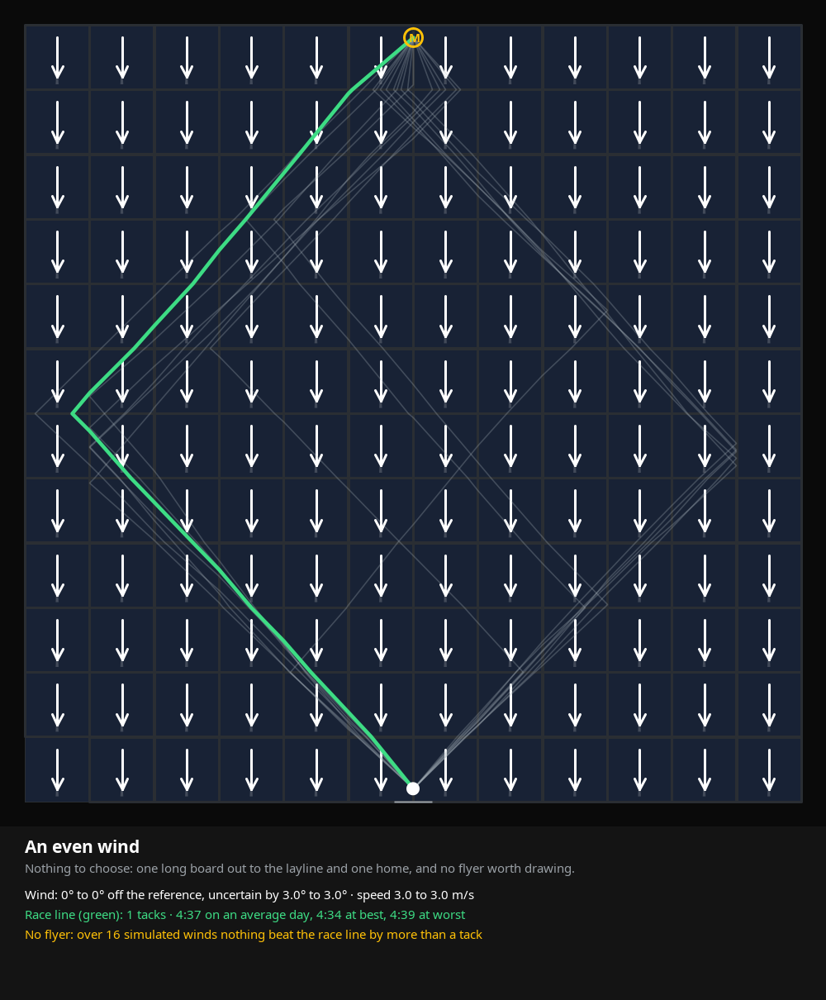
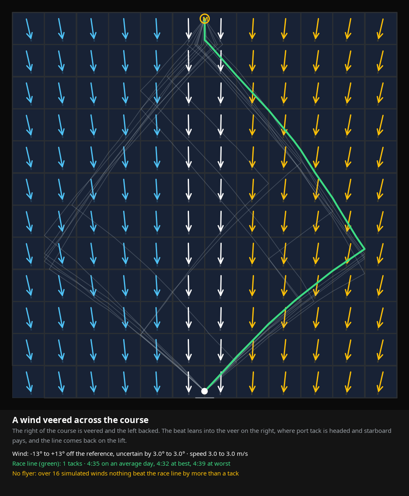
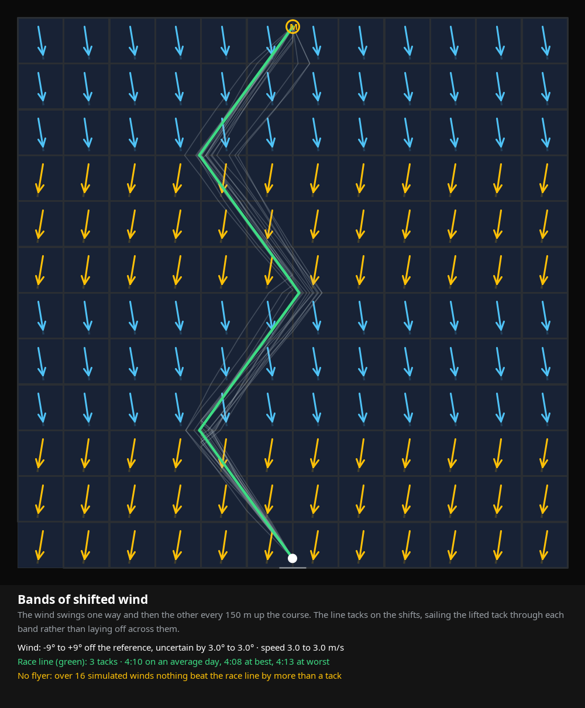
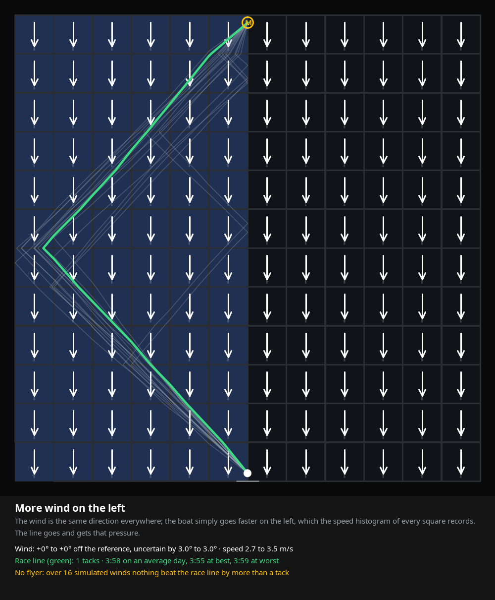
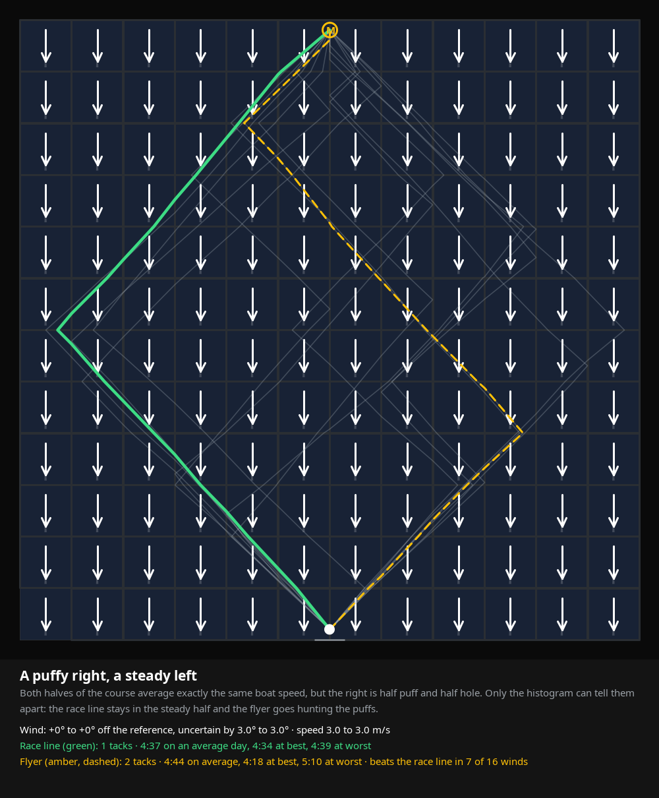
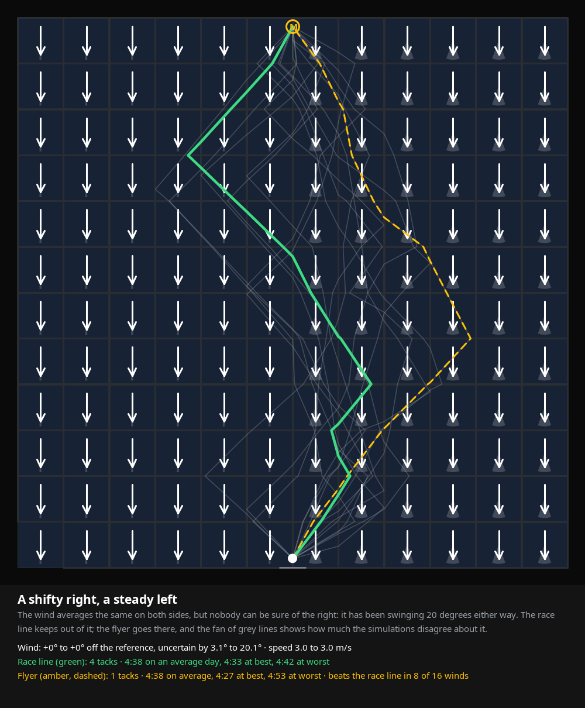
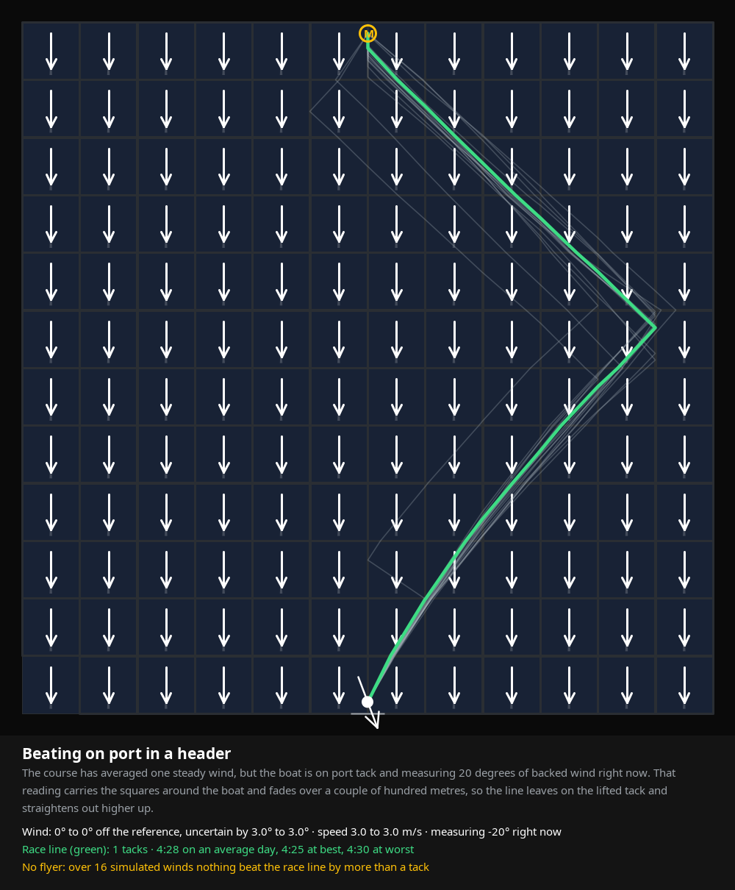
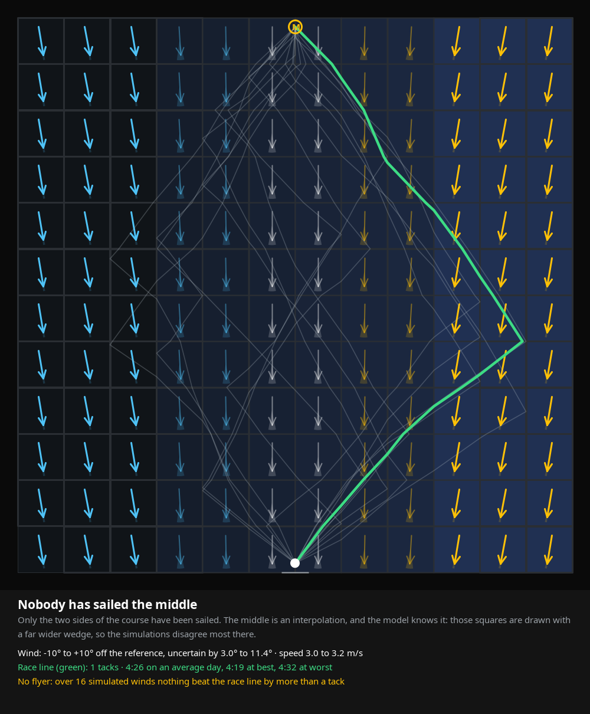
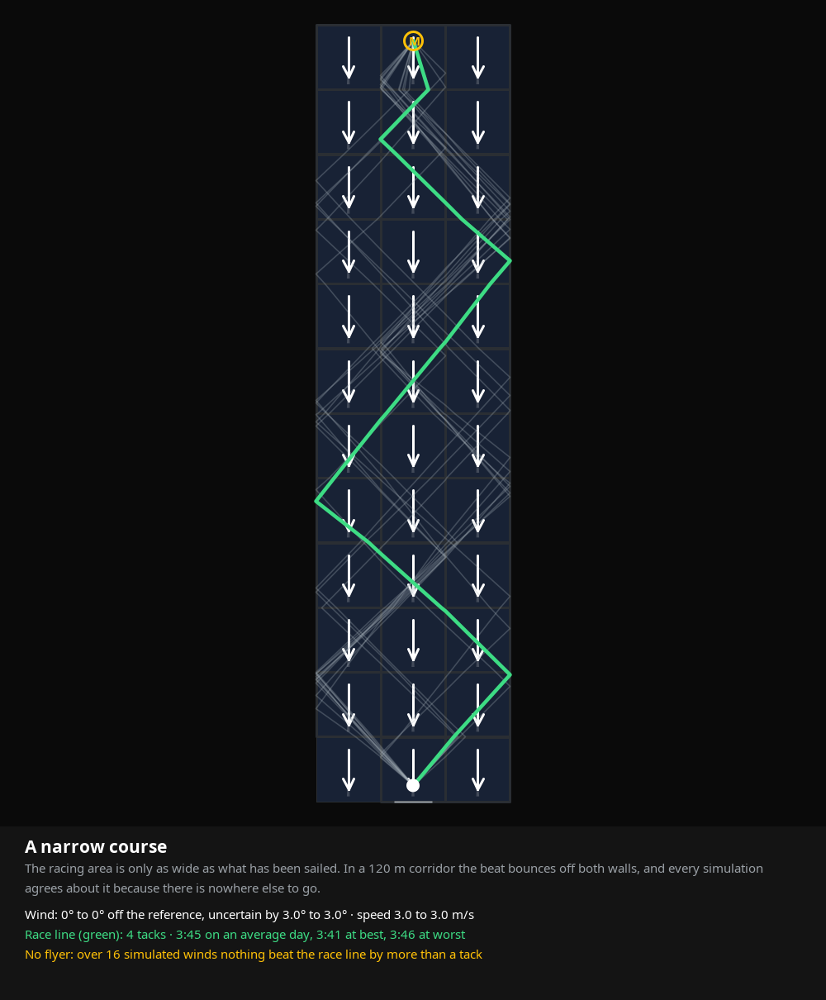
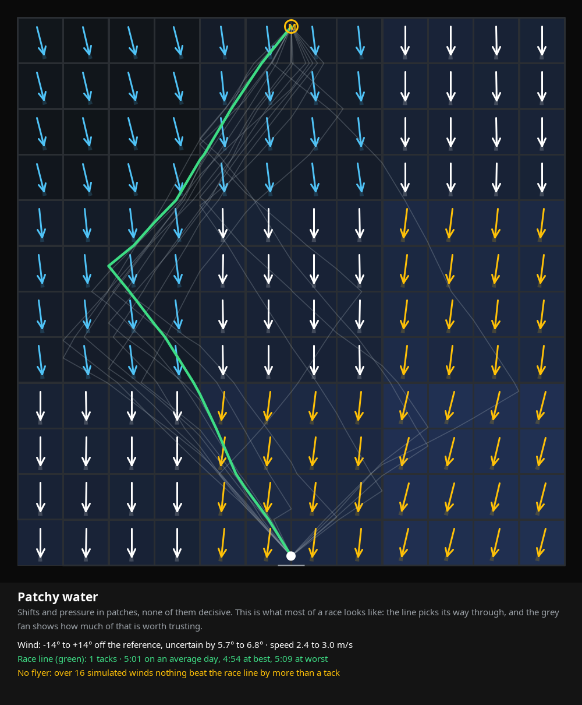

# The race line, in ten pictures

Written by `RaceLineGalleryTest`; run `./gradlew :domain:test` to draw them again.

Every picture is one racing area, wind up the page, the start at the bottom and the windward
mark **M** at the top. In each square an arrow points the way the wind there blows, amber where
it is veered and blue where it is backed, dim where nobody has sailed and it was estimated from
the squares that were; the pale wedge behind the arrow is how uncertain that wind is, and the
shading of the square is the boat speed measured in it, lighter for more pressure. The white dot
is the boat, with an arrow for the wind it is measuring right now where it has one.

The thin grey lines are the fastest beat of each of the 16 simulated winds - the spread of
opinion. The **green** line is the race line the map draws, the one whose bad day is least bad. The
**amber dashed** line, where there is one, is the flyer: the line that pays most when the wind is
kind, drawn only when it is worth at least a tack more than the race line on a good day.

## An even wind

Nothing to choose: one long board out to the layline and one home, and no flyer worth drawing.

Race line: 1 tack, 277 s on an average day (274-279 s). No flyer: nothing beat it by more than a tack.

## A wind veered across the course

The right of the course is veered and the left backed. The beat leans into the veer on the right, where port tack is headed and starboard pays, and the line comes back on the lift.

Race line: 1 tack, 275 s on an average day (272-279 s). No flyer: nothing beat it by more than a tack.

## Bands of shifted wind

The wind swings one way and then the other every 150 m up the course. The line tacks on the shifts, sailing the lifted tack through each band rather than laying off across them.

Race line: 3 tacks, 250 s on an average day (248-253 s). No flyer: nothing beat it by more than a tack.

## More wind on the left

The wind is the same direction everywhere; the boat simply goes faster on the left, which the speed histogram of every square records. The line goes and gets that pressure.

Race line: 1 tack, 238 s on an average day (235-240 s). No flyer: nothing beat it by more than a tack.

## A puffy right, a steady left

Both halves of the course average exactly the same boat speed, but the right is half puff and half hole. Only the histogram can tell them apart: the race line stays in the steady half and the flyer goes hunting the puffs.

Race line: 1 tack, 277 s on an average day (274-279 s). Flyer: 2 tacks, 284 s (258-310 s), ahead in 7 of 16 winds.

## A shifty right, a steady left

The wind averages the same on both sides, but nobody can be sure of the right: it has been swinging 20 degrees either way. The race line keeps out of it; the flyer goes there, and the fan of grey lines shows how much the simulations disagree about it.

Race line: 4 tacks, 278 s on an average day (273-282 s). Flyer: 1 tack, 278 s (267-293 s), ahead in 8 of 16 winds.

## Beating on port in a header

The course has averaged one steady wind, but the boat is on port tack and measuring 20 degrees of backed wind right now. That reading carries the squares around the boat and fades over a couple of hundred metres, so the line leaves on the lifted tack and straightens out higher up.

Race line: 1 tack, 268 s on an average day (265-270 s). No flyer: nothing beat it by more than a tack.

## Nobody has sailed the middle

Only the two sides of the course have been sailed. The middle is an interpolation, and the model knows it: those squares are drawn with a far wider wedge, so the simulations disagree most there.

Race line: 1 tack, 266 s on an average day (259-272 s). No flyer: nothing beat it by more than a tack.

## A narrow course

The racing area is only as wide as what has been sailed. In a 120 m corridor the beat bounces off both walls, and every simulation agrees about it because there is nowhere else to go.

Race line: 4 tacks, 225 s on an average day (221-226 s). No flyer: nothing beat it by more than a tack.

## Patchy water

Shifts and pressure in patches, none of them decisive. This is what most of a race looks like: the line picks its way through, and the grey fan shows how much of that is worth trusting.

Race line: 1 tack, 301 s on an average day (294-309 s). No flyer: nothing beat it by more than a tack.
