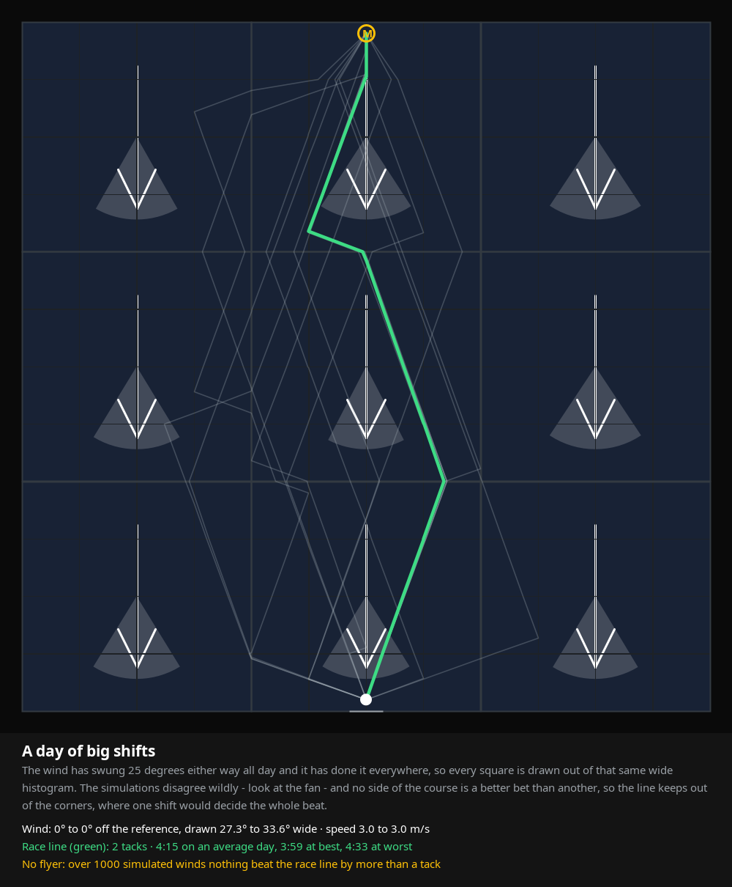

# The race line, in ten pictures

Written by `RaceLineGalleryTest`; run `./gradlew :domain:test` to draw them again.

Every picture is one racing area, wind up the page, the start at the bottom and the windward
mark **M** at the top. The thin grid is the racing area, the squares the line bends on; the bold
one is the big squares the wind is worked out in, three across the course and as many rows as it
is tall. In each big square an arrow points the way its mean wind blows, amber where it is veered
and blue where it is backed, dim where too little was measured there to call it measured; the pale
wedge behind the arrow is how far the simulated winds spread there - its own history, the day's and
chance all told - and the shading of the square is the boat speed measured in it, lighter for more
pressure. The white dot is the boat, with an arrow for the wind it is measuring right now where it
has one.

The thin grey lines are the fastest beat of each of the 16 winds a beat was searched in, out of the
1000 every line is then timed through - the spread of opinion. The **green** line is the race line the
map draws, the one whose bad day is least bad. The **amber dashed** line, where there is one, is the
flyer: the line that pays most when the wind is kind, drawn only when it is worth at least a tack
more than the race line on a good day.

## An even wind

Nothing to choose: one long board out to the layline and one home, and no flyer worth drawing.

Race line: 1 tack, 278 s on an average day (275-280 s). No flyer: nothing beat it by more than a tack.

## A wind veered across the course

The right of the course is veered and the left backed. The beat leans into the veer on the right, where port tack is headed and starboard pays, and the line comes back on the lift.

Race line: 2 tacks, 278 s on an average day (271-286 s). No flyer: nothing beat it by more than a tack.

## Bands of shifted wind

The wind swings one way and then the other every 150 m up the course. The line tacks on the shifts, sailing the lifted tack through each band rather than laying off across them.

Race line: 2 tacks, 277 s on an average day (268-286 s). No flyer: nothing beat it by more than a tack.

## More wind on the left

The wind is the same direction everywhere; the boat simply goes faster on the left, which the speed histogram of every square records. The line goes and gets that pressure.

Race line: 1 tack, 272 s on an average day (259-285 s). No flyer: nothing beat it by more than a tack.

## A puffy right, a steady left

Both halves of the course average exactly the same boat speed, but the right is half puff and half hole. Only the histogram can tell them apart: the race line stays in the steady half and the flyer goes hunting the puffs.

Race line: 1 tack, 300 s on an average day (263-337 s). Flyer: 2 tacks, 301 s (256-340 s), ahead in 498 of 1000 winds.

## A day of big shifts

The wind has swung 25 degrees either way all day and it has done it everywhere, so every square is drawn out of that same wide histogram. The simulations disagree wildly - look at the fan - and no side of the course is a better bet than another, so the line keeps out of the corners, where one shift would decide the whole beat.

Race line: 2 tacks, 255 s on an average day (240-273 s). No flyer: nothing beat it by more than a tack.

## Beating on port in a header

Everything measured so far says the wind is up the course, but the boat is on port and measuring it 20 degrees backed right now. That header is a third of the simulated winds, over the whole course at once, and the rest are the day as it has been - so the plan leans into it without betting the beat on one moment: the line comes back sooner than the day's wind alone would have it, and starting on starboard would cost a tack.

Race line: 1 tack, 281 s on an average day (278-286 s). Flyer: 1 tack, 291 s (261-310 s), ahead in 349 of 1000 winds.

## Nobody has sailed the middle

Only the two sides of the course have been sailed. The middle is an interpolation, and the model knows it: those squares are drawn with a far wider wedge, so the simulations disagree most there.

Race line: 2 tacks, 269 s on an average day (259-280 s). Flyer: 2 tacks, 268 s (255-281 s), ahead in 534 of 1000 winds.

## A narrow course

The racing area is only as wide as what has been sailed. In a 120 m corridor the beat bounces off both walls, and every simulation agrees about it because there is nowhere else to go.

Race line: 5 tacks, 226 s on an average day (223-230 s). No flyer: nothing beat it by more than a tack.

## Patchy water

Shifts and pressure in patches, none of them decisive. This is what most of a race looks like: the line picks its way through, and the grey fan shows how much of that is worth trusting.

Race line: 2 tacks, 310 s on an average day (298-321 s). Flyer: 3 tacks, 307 s (291-321 s), ahead in 586 of 1000 winds.
